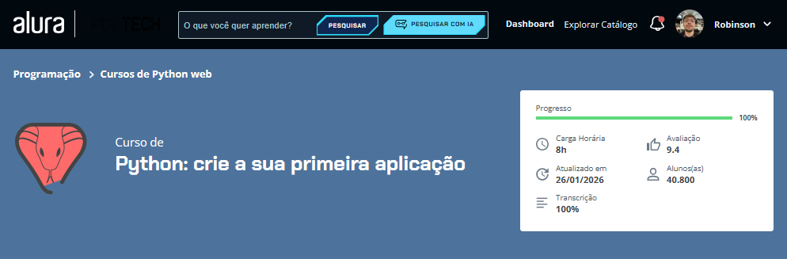

# 🍽️ Sabor Express

Projeto desenvolvido durante o curso **Python: crie a sua primeira aplicação**, da **Alura**.

A proposta do curso foi construir uma aplicação em Python para praticar os primeiros conceitos da linguagem de forma aplicada, passando por estrutura de menu, funções, condicionais, laços de repetição, tratamento de exceções e uso de estruturas como listas e dicionários.

---

## 📚 Sobre o projeto

O **Sabor Express** é uma aplicação de terminal desenvolvida em Python para realizar o gerenciamento simples de restaurantes.

Com ela, é possível:

- cadastrar novos restaurantes;
- listar os restaurantes já registrados;
- alternar o status entre ativo e desativado;
- navegar por um menu interativo no terminal.

Esse projeto foi importante para consolidar minha base em Python, principalmente na organização do código em funções e na construção de uma aplicação prática com interação via terminal.

---

## 🚀 Funcionalidades

- ✅ Exibição do nome do sistema em ASCII
- ✅ Menu interativo no terminal
- ✅ Cadastro de restaurantes
- ✅ Listagem formatada dos restaurantes
- ✅ Alteração de status do restaurante
- ✅ Tratamento de erro para opções inválidas
- ✅ Retorno ao menu principal após cada ação

---

## 🧠 Conceitos praticados

Durante o desenvolvimento deste projeto, coloquei em prática conceitos como:

- `print()` e `input()`
- variáveis
- condicionais com `if`, `elif` e `else`
- funções
- listas
- dicionários
- laço de repetição `for`
- tratamento de exceções com `try` e `except`
- manipulação de fluxo da aplicação
- organização e refatoração de código

---

## 🛠️ Tecnologias utilizadas

- **Python**
- **VS Code**

---

## 📂 Arquivos do projeto
Nesta pasta estão os exercícios e práticas desenvolvidos durante o curso.

## Status
Curso finalizado.

## Capa do curso

## Certificado

[📄 Visualizar certificado](./certificado-curso-python-crie-a-sua-primeira-aplicação(pt).pdf)
