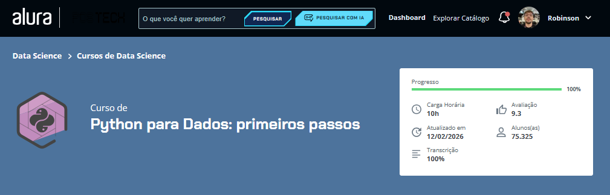

# Python para Dados: primeiros passos

## Sobre o curso
Este curso foi voltado à construção de uma base sólida em Python com foco na área de dados, abordando desde os primeiros comandos da linguagem até estruturas essenciais para desenvolvimento e manipulação de informações.

## Módulos e aprendizados

### 1. Começando com Python
Neste módulo, aprendi os primeiros conceitos da linguagem, incluindo a preparação do ambiente de desenvolvimento, o uso do Google Colab e a execução dos primeiros comandos em Python. Também compreendi a função do `print()` e sua importância para exibir informações na tela.

### 2. Manipulando dados no Python
Aprofundei meus conhecimentos em variáveis, tipos de dados e operadores. Aprendi a armazenar informações, utilizar `input()` para coletar dados do usuário, aplicar `type()` para identificar tipos de variáveis e trabalhar com números, textos e formatação de saída.

### 3. Estruturas condicionais
Neste módulo, aprendi a utilizar estruturas de decisão como `if`, `elif` e `else`, além de operadores relacionais e lógicos. Esse conteúdo foi essencial para entender como criar regras no código e tomar decisões com base em diferentes condições.

### 4. Estruturas de repetição
Nesta etapa, aprendi a trabalhar com laços de repetição, utilizando `while` e `for`. Com isso, compreendi como automatizar tarefas repetitivas, percorrer sequências de dados e tornar o código mais dinâmico e eficiente.

### 5. Estruturas de dados
Por fim, estudei estruturas fundamentais para organização e manipulação de informações, com foco em **listas** e **dicionários**. Aprendi como armazenar múltiplos valores, acessar elementos, realizar manipulações e estruturar melhor os dados dentro do programa.

## Arquivo do projeto
Nesta pasta está o notebook principal desenvolvido durante o curso:

- `Projeto_Python_Data_Science.ipynb`

## Conclusão
Este curso contribuiu para consolidar meus conhecimentos iniciais em Python e ampliar minha visão sobre como a linguagem pode ser aplicada na área de dados, servindo como base para estudos mais avançados em análise de dados, ciência de dados e machine learning.

## Status
Curso finalizado.

## Capa do curso

## Certificado

[📄 Visualizar certificado](./certificado-python-para-dados-primeiros-passos(pt).pdf)
